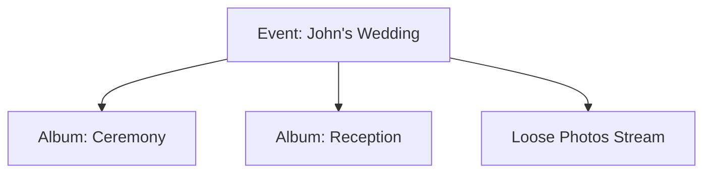

# 📸 Memorise: Smart Event Gallery


**Memorise** is a web-based "Smart Gallery" platform designed to help photographers and event coordinators organize, manage, and showcase large collections of photos.

> 💡 **Concept:** Think of it as a custom-built version of Google Photos or Flickr, but structured specifically for **Events**.

---

## 📖 Table of Contents
- [The Core Concept](#-the-core-concept)
- [Key Features](#-key-features)
- [Target Audience](#-who-is-it-for)
- [Tech Stack](#-tech-under-the-hood)
- [Getting Started](#-getting-started)

---

## 🧠 The Core Concept

Instead of dumping thousands of photos into one big pile, **Memorise** uses a structured, two-tier hierarchy to keep memories organized:



- **Events:** The main container (e.g., "John's Wedding" or "Tech Conference 2024").
- **Albums (Folders):** Specific sub-collections inside an event (e.g., "Ceremony", "Keynote Speech").
- **Loose Photos:** A general stream of photos that belong to the event but aren't sorted into specific folders.

---

## 🚀 Key Features

- **Smart Uploading:**
  - Forget manual sorting. When you upload photos to an Event page, the system automatically detects the context and links the photos to that specific event instantly.
- **Visual Customization:**
  - Make your gallery look professional. Users can upload custom cover photos (banners) for both Events and Albums, creating a polished, portfolio-quality aesthetic.
- **Visual-First Navigation:**
  - Designed for browsing:
    - Click an Event Card to see the event details.
    - Select Albums to dive deeper into specific moments.
    - Scroll through the Photo Grid for the general stream.

---

## 👥 Who is it for?

- **Photographers:** Deliver organized work to clients in a branded environment.
- **Event Coordinators:** A centralized hub to share memories from weddings, conferences, or parties.
- **Archivists:** Anyone managing large libraries of image data.

---

## 🛠 Tech Under the Hood

This project runs on a powerful Full-Stack architecture:

### Backend (The Heavy Lifting)
- **Language:** Python
- **Framework:** Django & Django REST Framework (DRF)
- **Database:** SQLite (Dev) / PostgreSQL (Prod)
- **Key Logic:** Complex data modeling for Event → Album → Photo relationships.

### Frontend (The Experience)
- **Library:** React.js (Vite)
- **Styling:** Tailwind CSS
- **Icons:** Lucide React
- **HTTP Client:** Axios
- **Features:** Drag-and-drop uploads, dynamic routing, and modal interactions.

---

## ⚡ Getting Started

### Prerequisites
- Node.js & npm
- Python 3.8+

### 1. Clone the Repository
```bash
git clone https://github.com/yourusername/memorise-gallery.git
cd memorise-gallery
```

### 2. Backend Setup (Django)
```bash
cd backend
python -m venv venv
# On Windows:
venv\Scripts\activate
# On macOS/Linux:
source venv/bin/activate
pip install -r requirements.txt
python manage.py migrate
python manage.py runserver
```

### 3. Frontend Setup (React)
```bash
cd frontend
npm install
npm run dev
```

Visit [http://localhost:5173](http://localhost:5173) to view the app!

---

## 🔮 Future Roadmap

- [ ] Photographer Portfolios: Public profile pages for specific users.
- [ ] AI Tagging: Auto-detection of objects in photos.
- [ ] Batch Download: Download entire albums as ZIP files.
